# GG.Net Data Visualization

GG.Net lets Data Scientists and Developers create interactive and flexible charts for [Blazor](https://dotnet.microsoft.com/apps/aspnet/web-apps/blazor) Web Apps in C#.

Taking its inspiration from the highly popular [ggpplot2](https://ggplot2.tidyverse.org) R package, GG.Net provides natively rich features for your Data Analysis Workflow. Build publication quality charts with just a few lines of code.

[Learn more about GG.Net](https://pablofrommars.github.io/)

### Examples Gallery

| | | |
|-|-|-|
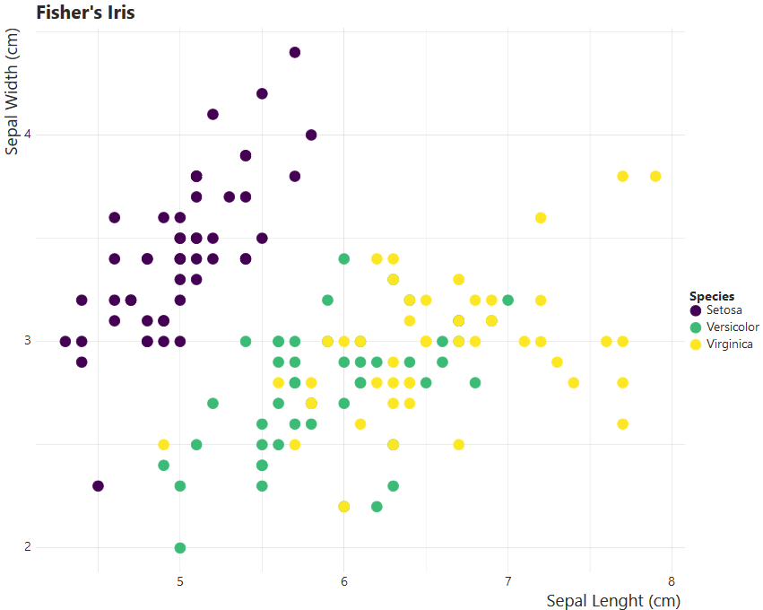 | 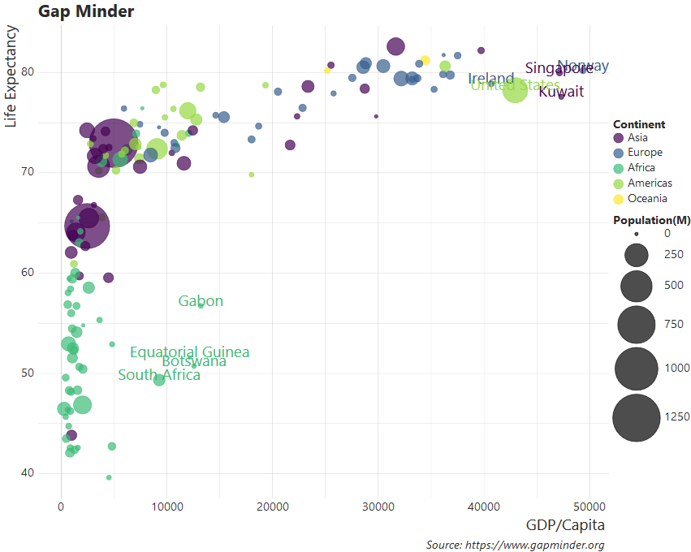 | 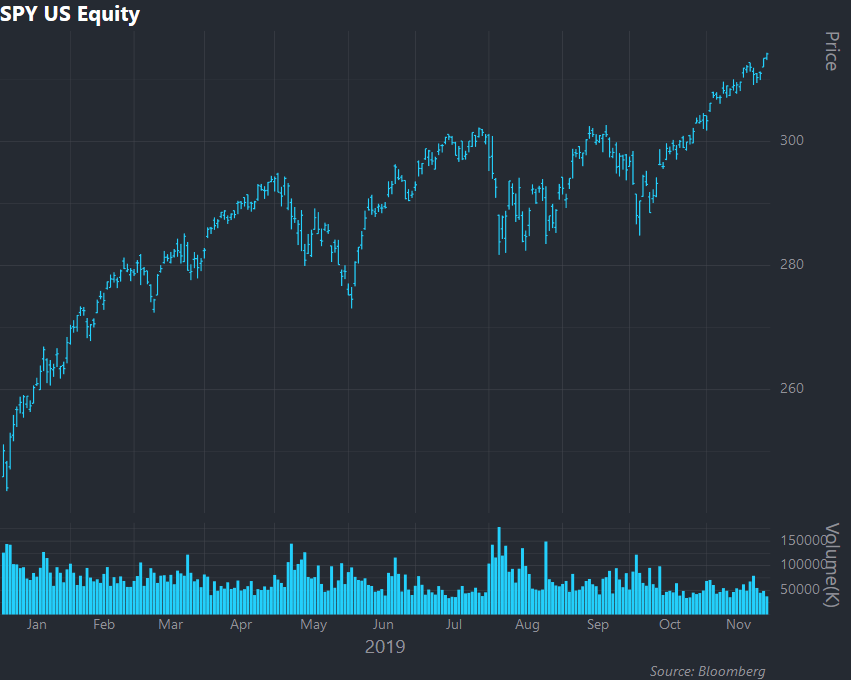
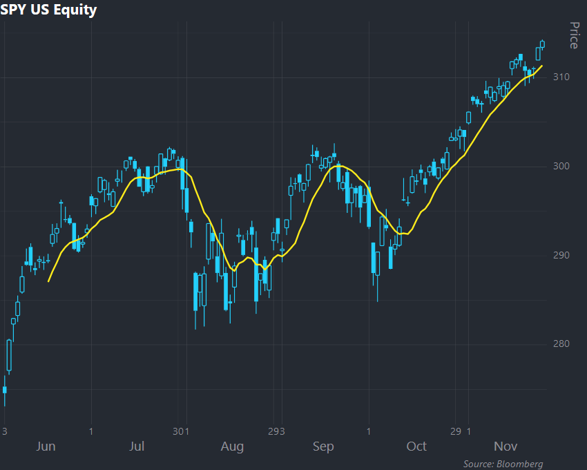 | 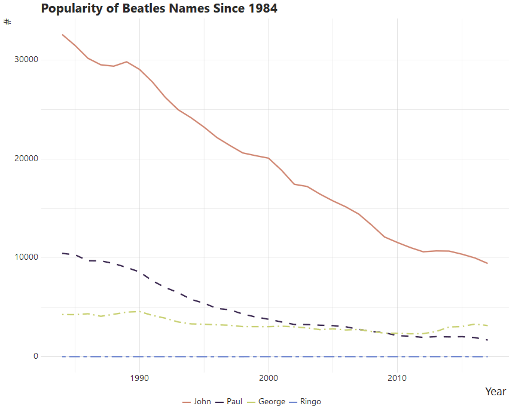 | 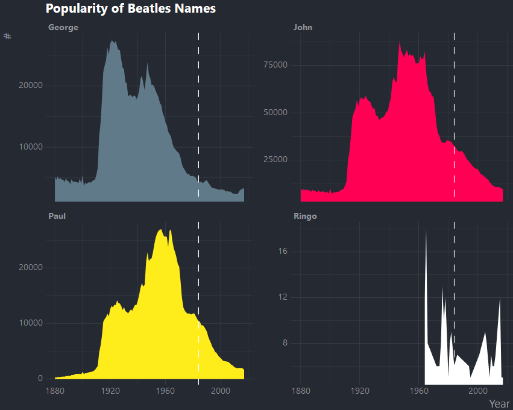
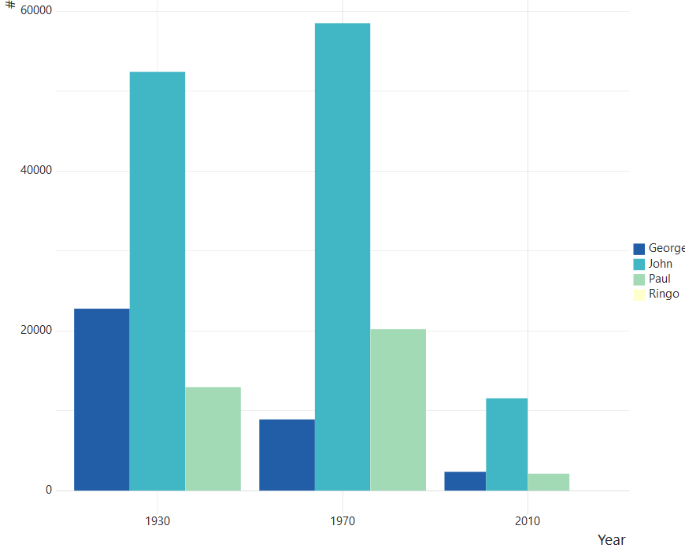 | 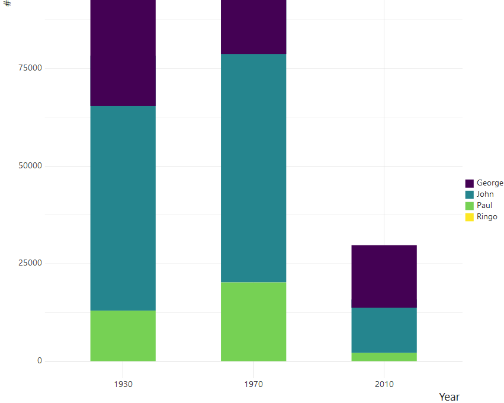 | 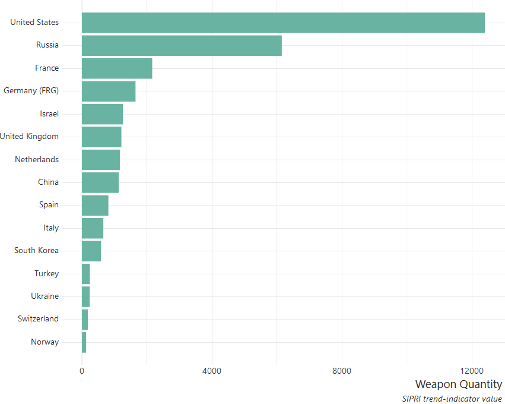
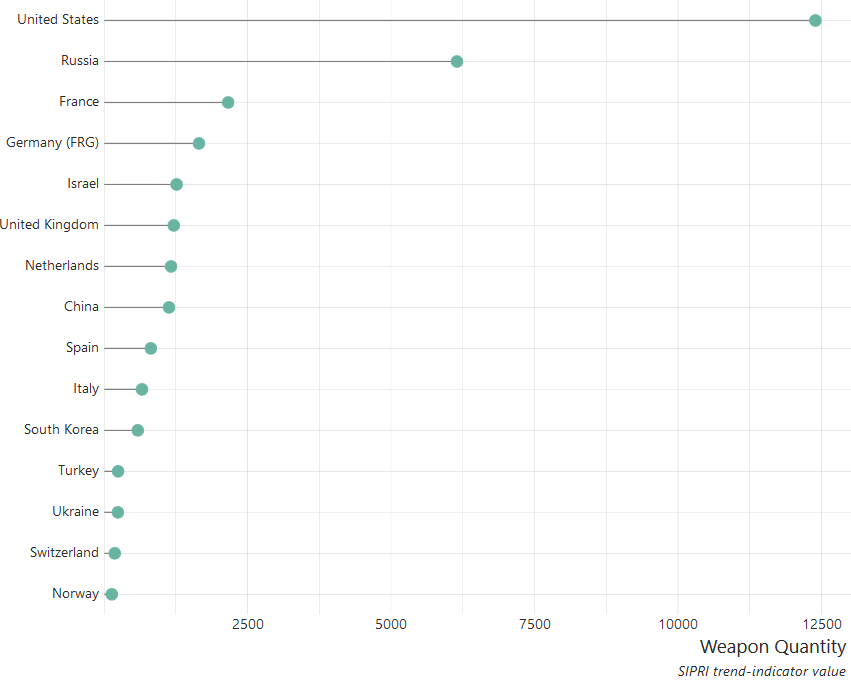 | 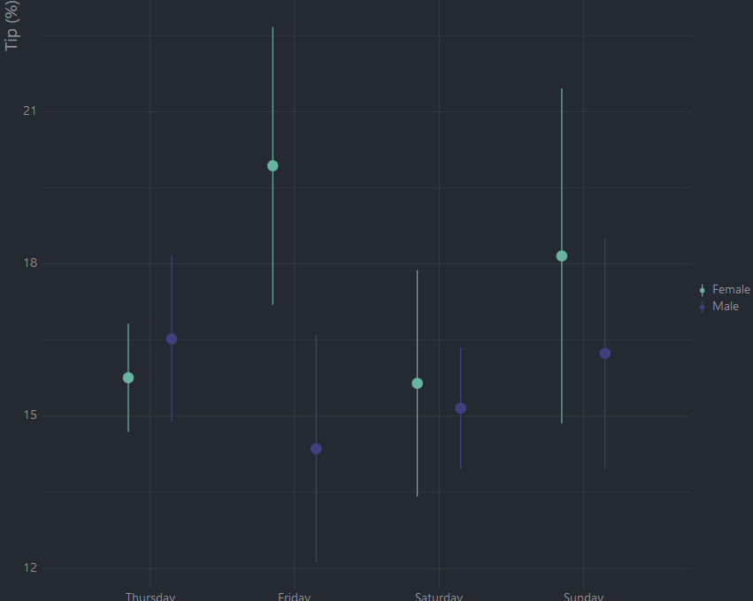 | 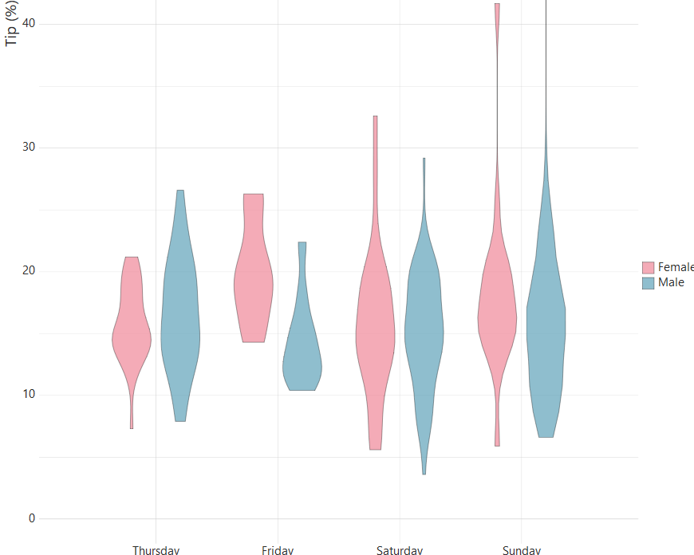
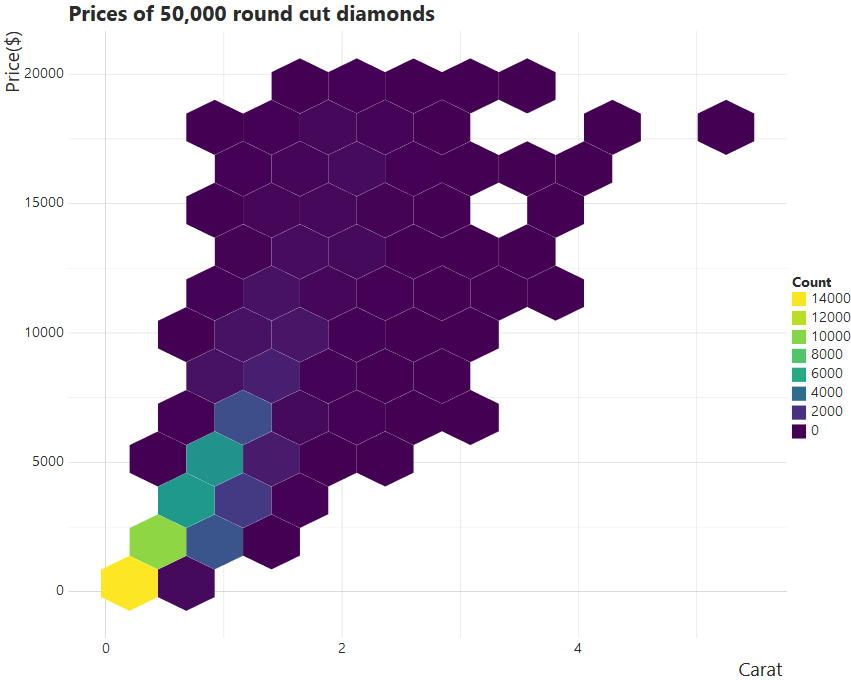 | 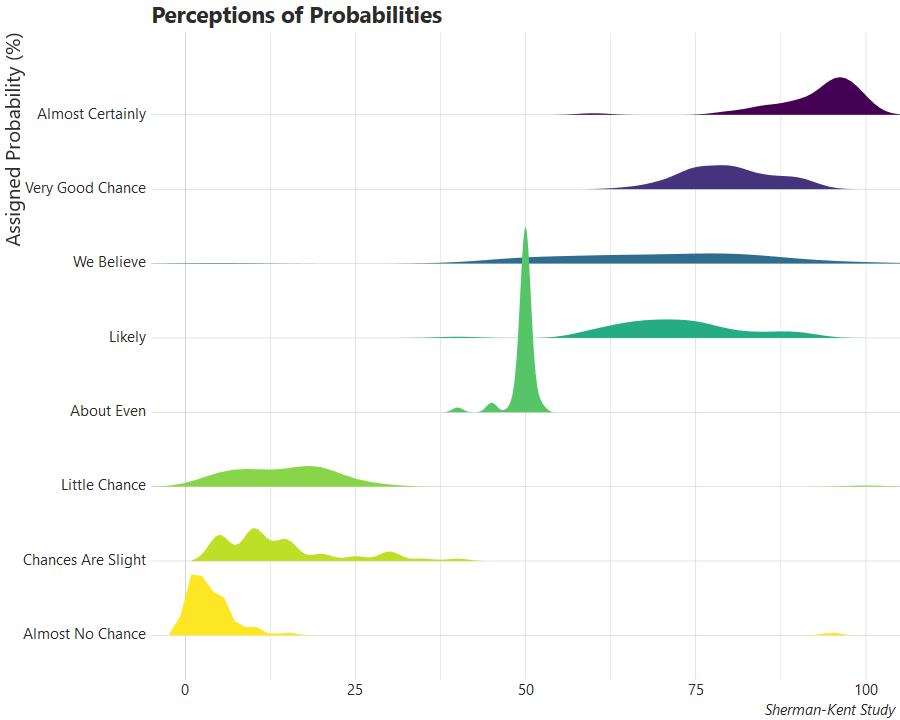 | 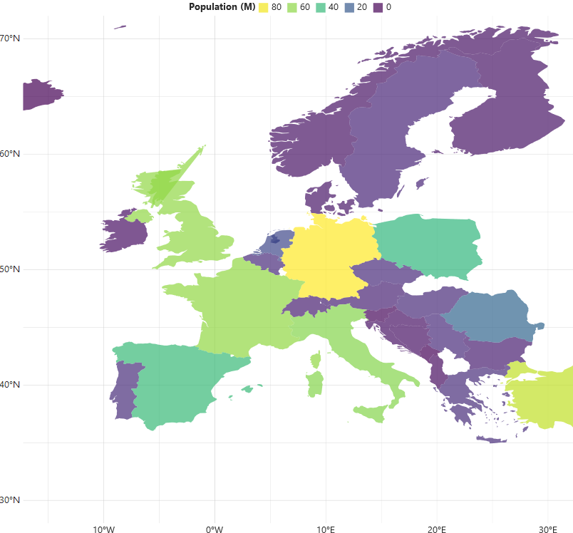
<td colspan=3>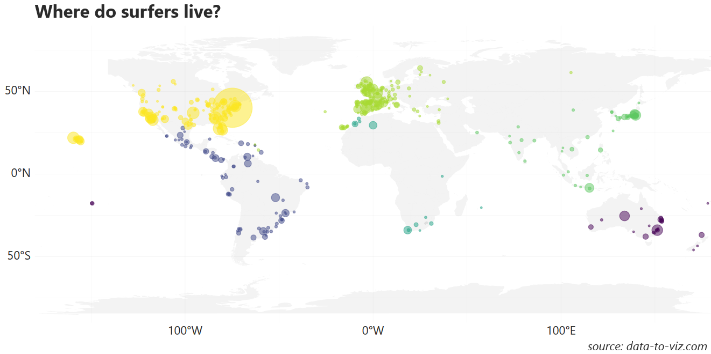
